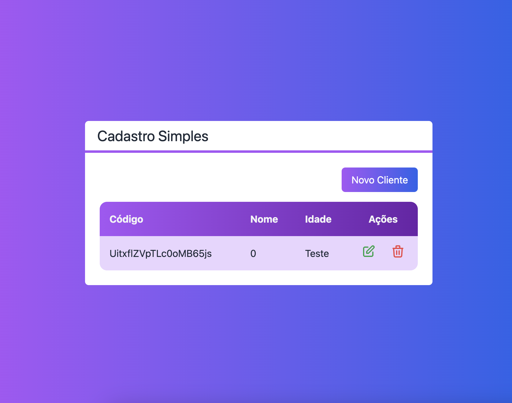

# CRUD

Descrição curta do seu projeto.

## Pré-requisitos

- Node.js (versão X.X.X)
- npm (ou Yarn)

## Instalação

1. Clone o repositório: `git clone https://github.com/iannak/next-crud-tailwindcss.git`
2. Navegue até o diretório do projeto: `cd seu-projeto`
3. Instale as dependências: `npm install` ou `yarn install`

## Configuração

1. Copie o arquivo `.env.example` para `.env` e configure as variáveis de ambiente, se necessário.

## Uso

Inicie o servidor de desenvolvimento:

```bash
npm run dev
# ou
yarn dev
